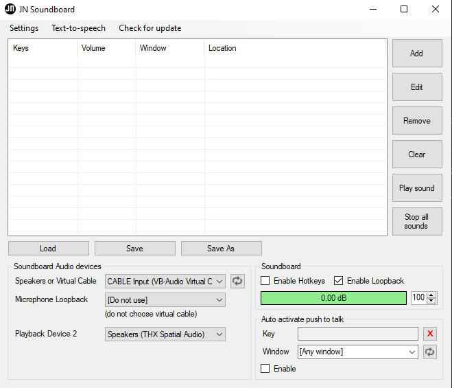
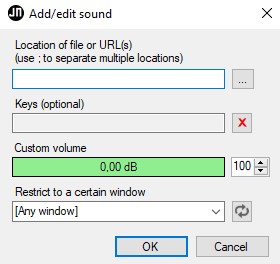
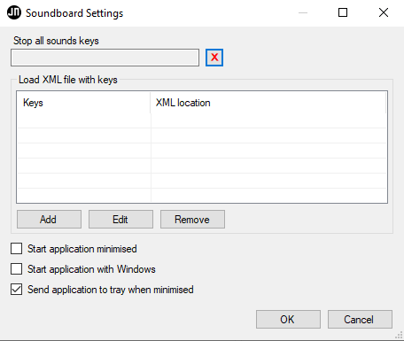
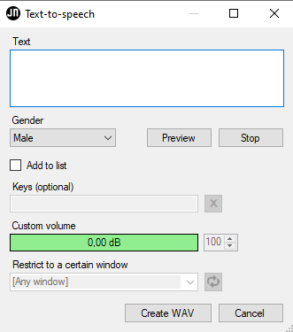

# JN Soundboard - ZenitH-AT Fork

A program written in C# using the NAudio library that uses hotkeys to play sounds into a chosen sound device. It is similar to [EXP Soundboard](https://sourceforge.net/projects/expsoundboard/), except that JN Soundboard is not as cross-platform as EXP, but, there are more features in JN than EXP.

A fork of ZenitH-AT's JN Soundboard. The goal with this fork is to add features that I feel should be added.

## Features:

- Can play MP3, WAV, WMA, M4A, and AC3 audio files. Can also play Youtube links. (To play youtube links, simply include the url to the video.)
- Play sounds through any sound device. (speakers, virtual audio cable, etc.)
- Microphone loopback (loops microphone sound through playback device). Allows you to also use your real mic at the same time as the soundboard.
- Add, edit, remove, and clear hotkeys.
- Can play a random sound from a list of sounds. Just select multiple files when adding a hotkey!
- Restrict hotkey so that the hotkey is only played when a certain window is in the foreground.
- Save and load hotkeys to XML file.
- Hotkey that stops currently playing sound.
- Hotkeys that load XML files containing sound hotkeys.
- Auto press your game or chat program's push-to-talk key when playing a sound.
- Text-to-speech WAV file creator.
- Optional second audio output so you can hear the sound playing.

## Requirements:

- .NET Framework 4.6
- NAudio

## How to play sounds through your speakers or headphones only:

- Set the "Speakers or Virtual Cable" device to your speakers or headphones then load and play sounds.

## How to play sound through your microphone so that people in your game or chat program can hear them:

In Windows, a playback device is normally a set of speakers or headphones, but it can also be a virtual cable. A virtual cable acts like a playback device, but is connected behind the scenes to a virtual microphone. Thus, an output device can masquerade as an input device. This lets applications like the soundboard "speak" through your games and chat applications, as long as you set the virtual cable as your microphone in Windows or in the app. In order to use your real microphone to chat at the same time, we have to "loopback" your microphone into the virtual output device. (If you were to loopback your mic to your speakers or headphones, instead, you would hear yourself speak. If you do this with your speakers, though, it might cause feedback.)

1. You will need to install a virtual audio cable. It will act as an audio output that sends played sounds to its virtual microphone. I recommend [VB-CABLE](https://www.vb-audio.com/Cable/index.htm)).
2. Set the "Speakers or Virtual Cable" device to the virtual audio output cable. E.g., "CABLE Input (VB-Audio Virtual Cable)".
3. (Optional) Set the microphone loopback device to your real microphone. This will mix your real mic in with the virtual mic so that you can speak _and_ play sounds. Note: Loopback only occurs when the "Enable Hotkeys and Loopback" checkbox is checked.
4. (Optional) If you would also like to have the sounds played through your speakers or headphones, set Playback Device 2 to that device.
5. Make sure the virtual microphone (e.g., "CABLE Output (VB-Audio Virtual Cable)") is either your default microphone in Windows or set as the desired microphone in the game or application that is going to use it.

## Screenshots:

## EmbarassingUsername's changes:

- Added second sound output for also playing the sounds to yourself while playing them through the virtual cable.
- Added gender selector for Text-to-Speech (TTS) dialog.
- Added a Preview button to the TTS dialog along with a Stop button.
- TTS dialog text is now multi-line.
- TTS dialog now prompts for a filename instead of using the text as the filename.
- Added tooltips to audio device selectors with quick instructions.
- Relabeled device selectors in main form to be more clear.
- Added "clear" buttons to all key-input text boxes. It was not obvious that Esc would clear them.
- Fixed Esc button closing the Add Hotkey dialog (instead of clearing the hotkey) when the keys textbox has focus.
- Forced dialogs to open in the center of the main window.
- Forced main window to open in center of screen.
- Removed the requirement that there be hotkeys defined in order to enable the main checkbox. This is so Loopback can be tested even without there being hotkeys defined.
- In Settings dialog, prevented the "Stop all sounds hotkey" textbox from automatically having focus when opening the settings.
- Adjusted some popup messages to make them more simple and/or clear.
- Added detailed information and instructions to README regarding using a virtual cable.
- Rearranged the main form slightly; added explanatory text to the main Enabled checkbox.
- Fixed some button alignments.
- Refactored some of the code.

## ZenitH-AT's changes:

- Added start with windows and start minimised to settings.
- Program now only allows for one instance at a time.
- Added open and exit buttons to the tray icon.
- All options are saved as settings automatically so that they are remembered between launches.
- Device and window selector refreshes will reselect the last item if still present after the reload.
- Enable hotkeys and enable loopback are now separate buttons.
- Launching the program will start loopback without needing to untick and retick the checkbox.
- Added a scrollable sound volume control to the main form and add/edit sound form (the slider in the main form only affects sounds without custom volumes).
- Fixed several bugs related to the TTS form.
- TTS form now uses a checkbox to add to list, rather than use a different button.
- TTS form now allows the user to set a window restriction and custom volume.
- Fixed a few issues related to XML validation.
- XML saving now uses a timer to prevent file in use errors when saving settings (allows for more settings to be saved and push to talk hotkey timer to be reduced)
- Improved the responsiveness of key fields without causing clicking the field to set the key (timer interval is temporarily lowered after first timer tick until leaving the field)
- All keys fields no longer show context menus to make setting a key as right click easier (ShortcutsEnabled false).
- Reimplemented the Keys enum to include definitions for every key possible. LuaMacros users rejoice!
- Centralised redundant code in various areas (e.g. window listing and key combination code).
- Adjusted UI sizing, padding, tab stops and so on.
- Adjusted/added some tooltips.
- Fixed additional minor issues and inconsistencies.
- Refactored some of the code.

## BonnieToGamer's changes:

- Fixed naming rule violations.
- Removed the use of unexplicit variable types.
- Added .gitignore.
- Fixed screenshots.
- Added ability to use Youtube links.
